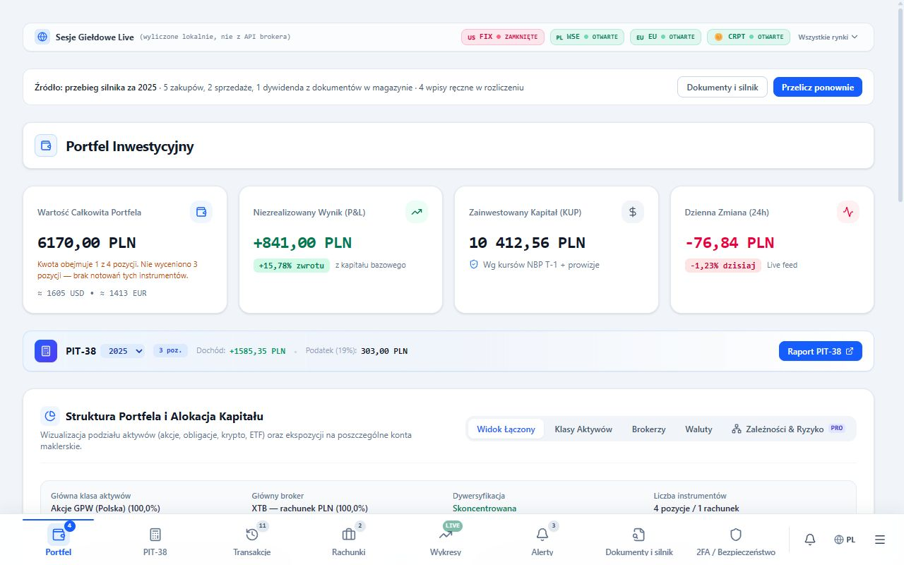
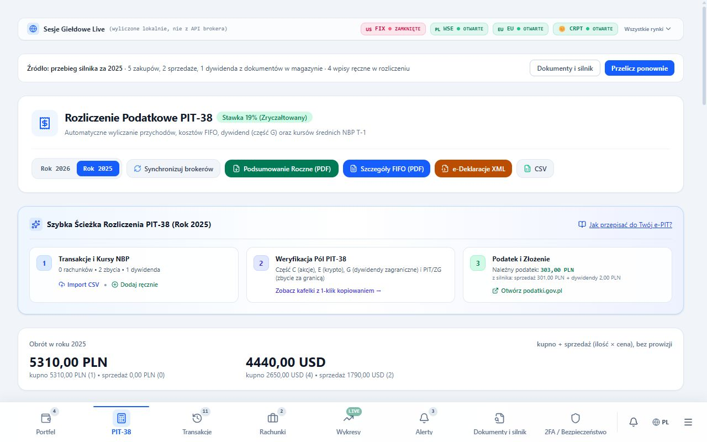
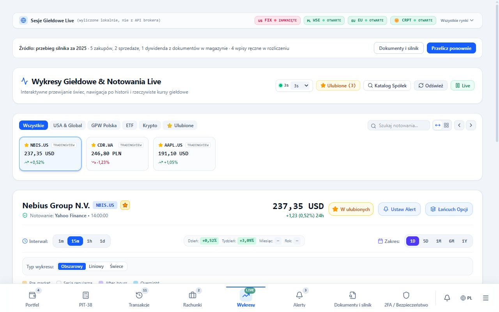
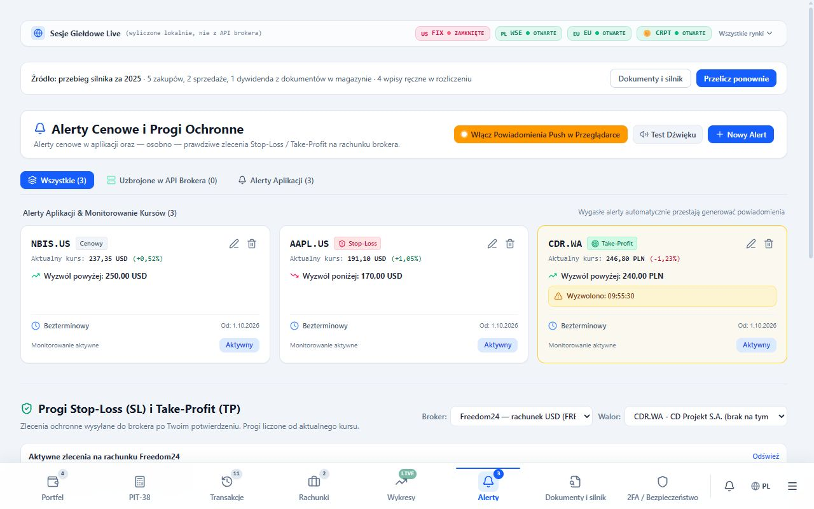
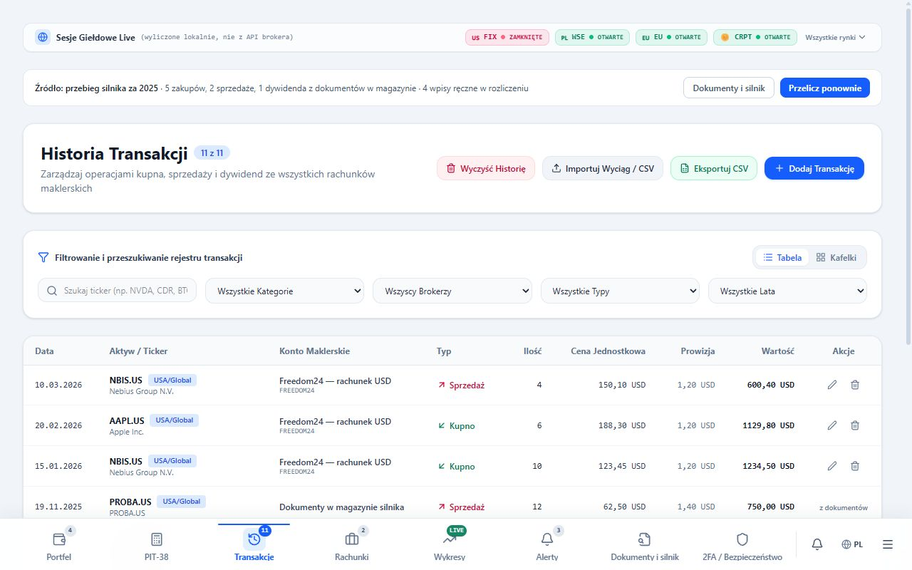
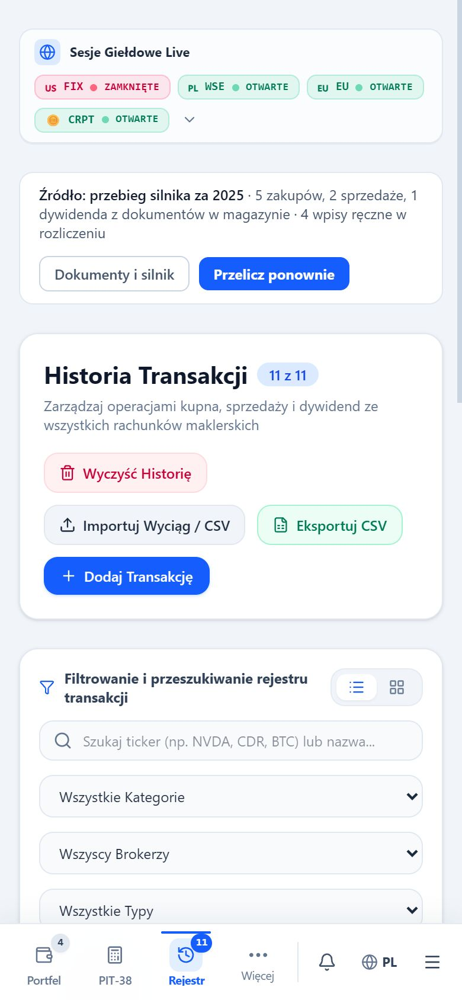

# InvestAnalyzer

InvestAnalyzer to lokalna aplikacja dla Windows, która łączy portfel inwestora z deterministycznym kalkulatorem PIT-38 na podstawie plików brokera.

`Windows` · `lokalnie bez chmury` · `PIT-38` · `Tauri + React + Python` · `licencja: tylko użytek niekomercyjny`

## Dla kogo i po co

Inwestor korzystający z zagranicznego brokera musi przeliczyć przychody i koszty na złote,
połączyć sprzedaże z zakupami oraz uwzględnić zagraniczne dywidendy i podatek u źródła.
Wyciąg brokera nie zastępuje rozliczenia PIT-38 i informacji PIT-ZG; znaczenie mają kursy NBP T-1, historia nabycia oraz dowody każdej kwoty.

Program oblicza przychody, koszty uzyskania przychodu, dochód lub stratę i podatek
od zagranicznych instrumentów finansowych. Przygotowuje wynik i materiały do jego sprawdzenia.
Rozliczenie z plików nie wymaga klucza API brokera.
Programista znajdzie tu oddzielony silnik podatkowy oraz dwa środowiska uruchomienia tego samego interfejsu.

## Co umie

### Rozliczenie

- Silnik FIFO łączy sprzedaże z najstarszymi partiami zakupu, także z historią wieloletnią.
- Każda kwota ma ślad dowodowy: **plik → kurs NBP → partia FIFO → wyliczenie → podstawa prawna**.
- Rozliczenie obejmuje dywidendy zagraniczne, podatek u źródła i straty z lat ubiegłych.
- Pakiet PIT-38/PIT-ZG i eksport do e-PIT pomagają przenieść wynik do zeznania;
  dostępne są też raporty, XLSX i JSON. Gotowość wyniku zależy od bramek opisanych niżej.
- Ręczne korekty, rozstrzygnięcia dowodowe i zamknięcia roku zapisują decyzje użytkownika.
- Kopie decyzji można przywrócić lub wyeksportować do pliku na inny komputer.
- Nieczytelne wpisy trafiają do lokalnej kwarantanny; panel pozwala pobrać je do JSON lub usunąć po potwierdzeniu.
- Gdy kopii przed odzyskiwaniem nie da się zapisać albo jest niepełna, kontynuacja wymaga świadomej zgody.

### Portfel

- Notowania na żywo, podgląd aktywów i historia transakcji.
- Alerty cenowe, wykresy i katalog instrumentów.
- Obsługa rachunków brokerskich oraz import CSV/XLSX.
- Blokada dostępu z 2FA oraz interfejs dostosowany do wąskich ekranów.
- Po konfiguracji kluczy: odczyt rachunku i eksport przez Freedom24/Tradernet
  oraz odczyt rachunku i transakcji przez Binance.
- Wersja web wymaga jawnego potwierdzenia zleceń SL/TP i ich anulowania;
  adapter Freedom24 w desktopie obsługuje tylko odczyt.

## Zrzuty ekranu

Strona projektu z tymi zrzutami: https://investanalyzer-strona.dismonder.workers.dev
Repozytorium i wydania: https://github.com/Dismonder/InvestAnalyzer-PIT38
Aplikacja online (PWA): https://investanalyzer-app.dismonder.workers.dev

Wszystkie widoki poniżej pokazują dane syntetyczne z testów, nie prawdziwy rachunek.

### Portfel



### PIT-38



### Wykresy



### Alerty



### Transakcje



Dane syntetyczne — przykład historii transakcji.

### Portfel na telefonie



Dane syntetyczne — wąski widok interfejsu; aplikacja desktop jest przeznaczona dla Windows.

## Jak to działa

Interfejs React 19/TypeScript, budowany przez Vite, prezentuje dane i nie liczy podatku.
W trybie web i deweloperskim używa serwera Express, a w produkcyjnym desktopie powłoki Tauri v2 w Rust, bez Express i produkcyjnego portu HTTP.
Powłoka zapisuje `request.json`, uruchamia silnik Python 3.12 jako sidecar PyInstaller `onedir` i odczytuje `result.json` albo `error.json`.
Cała matematyka finansowa używa `decimal.Decimal`, bez typów zmiennoprzecinkowych, aby wynik był deterministyczny co do grosza.
Pliki brokera i wyniki pozostają na dysku zgodnie z zasadą local-first, bez chmury dla danych rozliczenia; silnik korzysta z sieci tylko w celu uzupełnienia kursów NBP.
Notowania i integracje rachunków korzystają z zewnętrznych API, a lokalny model językowy pomaga rozpoznawać dokumenty i mapować kolumny, bez liczenia podatku.

| Warstwa | Rola i połączenie |
|---|---|
| React / Vite UI | → Express (web/dev) albo Tauri (produkcyjny desktop) |
| Express / Tauri | → kontrakt JSON sidecara |
| Python / PyInstaller | → lokalne pliki brokera; FIFO, NBP, PIT-38 |
| Dysk | Pliki źródłowe → raporty, XLSX, JSON, pakiet PIT-38 |

Schematy kontraktu: `investanalyzer.analysis-request.v1` i `investanalyzer.analysis-result.v1`.
Szczegóły: [kontrakt sidecara](docs/sidecar-contract.md) i [runtime desktop](docs/desktop-runtime.md).
Logika PIT/FIFO/NBP mieszka wyłącznie w `silnik/python/`.
Prace nad interfejsem i runtime'em desktop nie powinny jej dotykać.

### Zasady rozliczenia

- **NBP T-1:** tabela A z ostatniego dnia roboczego poprzedzającego uzyskanie przychodu
  lub poniesienie kosztu (art. 11a ust. 2 i 3 ustawy o PIT).
  Pierwszeństwo ma lokalne archiwum CSV. Braki uzupełnia `api.nbp.pl`, jeśli fallback jest włączony.
  Ostrzeżenie `NBP_COVERAGE_GAP` oznacza policzoną kwotę, ale niepełne pokrycie kursów w archiwum.
- **Podatek u źródła:** zagraniczne dywidendy uwzględniają podatek zapłacony za granicą i dopłatę do 19% w Polsce.
  Odliczenie nie przekracza polskiego podatku od tego dochodu (poz. 48); do dopłaty idzie różnica (poz. 49).
  Podatek zagraniczny powyżej 19% nie podlega odliczeniu ani zwrotowi.
- **Straty:** odliczenie przez pięć kolejnych lat, w roku do 50% straty albo jednorazowo do 5 000 000 zł
  (art. 9 ust. 3 w zw. z ust. 6). Strata wynika z wyniku całego roku, nie z sumy stratnych pozycji.
  Odliczenie wymaga potwierdzenia, że stratę wykazano w PIT-38.

| Plan podatkowy | Zakres |
|---|---|
| `conservative` | Wyłącznie bezsporne koszty bezpośrednie |
| `defensible` | Koszty dające się obronić dokumentem |
| `aggressive_user` | Także koszty finansowania i przewalutowań, każdy z dowodem i oceną ryzyka |

### Bramki gotowości do złożenia

Silnik działa w trybie fail-closed: opisuje wynik, ale blokuje uznanie go za gotowy do złożenia, gdy występuje:

1. Brak kursu NBP dla dowolnej transakcji.
2. Ujemny stan FIFO: sprzedaż ponad stan lub bez zapisanego nabycia.
3. Nierozwiązany konflikt wyciągów z tego samego okresu.
4. Niekompletne wejście: nieznormalizowany wiersz albo brak wymaganego pliku.
5. Kategoria obecna na wejściu bez żadnego śladu w wyniku (`CATEGORY_COVERAGE_LOST`).

Zablokowany wynik ma status `CALCULATION_BLOCKED` i `filing_ready: false`.
Bramka kategorii jest jedynym automatem wykrywającym jej ciche zniknięcie.
W historii silnika taka awaria zdarzyła się trzykrotnie mimo zielonych testów jednostkowych, dlatego
bramka jest automatyczna.

## Szybki start

### Na telefonie i w przeglądarce (PWA)

Aplikacja działa też online: https://investanalyzer-app.dismonder.workers.dev — dodaj ją do ekranu
głównego telefonu („Zainstaluj aplikację” w Chrome, „Dodaj do ekranu początkowego” w Safari).
W tej wersji działają portfel, notowania na żywo, wykresy i alerty; dane zostają w pamięci przeglądarki
telefonu i nie trafiają na serwer. Pozycje portfela liczy wtedy przeglądarka (FIFO, koszt po kursach NBP T-1),
a kwoty PIT-38 pozostają nieobliczone. Układ sprawdzony na rozmiarze Samsung Galaxy S25 (360×780 px). Rozliczenie PIT-38, import plików brokera i integracje brokera wymagają
wersji Windows albo lokalnego serwera (`npm run dev`), bo telefon nie ma silnika Pythona.

Hosting to Cloudflare Workers w planie darmowym: pliki statyczne z `wydania/web` i lekkie API notowań
(`aplikacje/web/worker.ts`, Yahoo Finance i NBP) bez bazy danych ani innych płatnych usług.
Wdrożenie: `npm run hosting:deploy`; podgląd lokalny Workera: `npm run hosting:dev` (port 8788).

### Dla użytkownika Windows

Gotową wersję przenośną (ZIP) pobierz z [wydań na GitHubie](https://github.com/Dismonder/InvestAnalyzer-PIT38/releases) i rozpakuj do dowolnego folderu.
Uruchom `InvestAnalyzer.exe` z kompletnego folderu paczki, razem z zasobami i katalogiem `binaries`.
Nie wymaga instalacji Node.js ani systemowego Pythona.
Po własnej budowie (`npm run desktop:portable`) foldery i ZIP-y wydań trafiają do `wydania/komputerowa/przenosna/wersje`.

Desktop zapisuje dane w `%APPDATA%\InvestAnalyzer` i `%LOCALAPPDATA%\InvestAnalyzer`.
Pliki brokera znajdują się w `storage`, a wygenerowane artefakty w `artifacts` pod `%APPDATA%\InvestAnalyzer`.
Import i migracja kopiują pliki; nie przenoszą ani nie usuwają oryginałów.
Migracja wymaga działania użytkownika i zapisuje `migration_manifest.json` w katalogu danych
aplikacji (`%APPDATA%\InvestAnalyzer`).
Wersja przenośna jest pierwszym kanałem wydania; podpisany instalator to późniejszy etap.
Automatyczne aktualizacje pozostają wyłączone do czasu podpisanych artefaktów i polityki rollbacku.

### Dla programisty

| Cel | Wymagania |
|---|---|
| Praca nad kodem | Node.js 20+, Python 3.12 |
| Budowa desktop | Dodatkowo Rust (msvc), Visual Studio Build Tools i WebView2 |

W katalogu repozytorium wykonaj:

```powershell
npm install
py -3.12 -m venv silnik/python/.venv
silnik/python/.venv/Scripts/python.exe -m pip install -e "silnik/python[desktop,test]"
npm run dev          # http://localhost:3000
npm run desktop:dev  # alternatywnie: desktop Tauri
```

Pliki brokera dla środowiska repozytorium umieść w `dane/pliki/`, poza kontrolą wersji.

| Plik startowy Windows w korzeniu | Działanie |
|---|---|
| `URUCHOM_DESKTOP_DEV.cmd` | Desktop w trybie deweloperskim |
| `ZBUDUJ_DESKTOP.cmd` | Budowa i pakowanie wersji przenośnej |
| `URUCHOM_DESKTOP.cmd` | Uruchomienie zbudowanej wersji przenośnej |
| `SPRAWDZ_JAKOSC.cmd` | Komplet bramek jakości |

## Jakość i bezpieczeństwo danych

Stan zapisany na **2026-10-01**:

| Pomiar | Wynik |
|---|---|
| Testy TypeScript / serwera | 990 PASS |
| Testy Python | 904 PASS w ostatniej pełnej weryfikacji; nie powtarzano 2026-10-01 |
| Testy Rust | 110 PASS w ostatniej pełnej weryfikacji; nie powtarzano 2026-10-01 |
| Początkowy JavaScript | 464,9 kB przy limicie 500 kB |
| Łączny JavaScript | 2743,5 kB przy limicie 2900 kB |

Codzienna praca i bramki:

```powershell
npm run lint                       # kontrola typów
npm test                           # frontend i serwer
npm run test:python                # silnik podatkowy
npm run verify                     # pełny zestaw bramek web/silnika
npm run perf:bundle                # rozmiar JavaScript
npm run assert:no-private-data     # dane prywatne w plikach śledzonych przez git
npm run scan:freedom24-secrets      # skan poświadczeń
```

`verify` uruchamia kolejno lint, testy TS, testy Pythona, build, `perf:bundle`,
`perf:server-bundle`, `perf:engine`, `smoke:storage`, `smoke:storage:ollama`,
`assert:no-retired-integrations`, `assert:no-private-data` i `scan:freedom24-secrets`.

```powershell
npm run desktop:engine:build    # sidecar Python / PyInstaller onedir
npm run desktop:engine:smoke    # test dymny sidecara
npm run desktop:parity          # zgodność sidecara ze źródłem
npm run desktop:rust:test       # testy powłoki Rust
npm run desktop:build           # budowa aplikacji
npm run desktop:portable        # paczka przenośna
npm run desktop:portable:smoke  # układ paczki i uruchomienie silnika bez systemowego Pythona
npm run desktop:verify         # weryfikacja desktop i budowa
npm run desktop:release:verify # pełna weryfikacja przed wydaniem
```

Sidecar buduj po każdej zmianie w `silnik/python/`; inaczej `desktop:parity` wykryje rozjazd.
Kryteria akceptacji i poprawności rozliczenia: [lista kontrolna wydania](docs/release-checklist.md).

Dane w `dane/` są poza repozytorium: `pliki/`, `out/`, `backupy/`, `logi/` i `tymczasowe/`.
Wyłączony jest też `out/` w korzeniu. Bramka sprawdza każdy plik śledzony przez git,
blokuje śledzenie katalogów wynikowych, wykrywa dane osobowe w źródłach
oraz prywatne nazwy plików w paczkach przenośnych.
Silnik nie wysyła danych rozliczenia; notowania pobierane są z Yahoo Finance i Binance, a kursy z NBP.

Pliki brokera można wgrać ponownie, ale nie odtworzy to ręcznych decyzji użytkownika.
**Ustawienia → Dane → Kopie Twoich decyzji** zapisują korekty transakcji, straty z lat ubiegłych,
prowizje bankowe, rozstrzygnięcia dowodowe i zamknięcia roku do `dane/backupy/`
(w desktopie: katalog danych aplikacji). Kopię można przywrócić i przenieść na inny komputer.

## Struktura repozytorium

| Katalog | Zawartość |
|---|---|
| `aplikacje/web/` | React 19 + Vite, serwer Express dla web/dev |
| `aplikacje/komputerowa/tauri/` | Powłoka desktop Tauri v2 (Rust) |
| `silnik/python/` | Silnik podatkowy: FIFO, NBP, PIT-38 |
| `jakosc/testy/` | Testy frontendu i serwera |
| `jakosc/dane-testowe/`, `jakosc/schematy/` | Dane testowe i schematy |
| `narzedzia/skrypty/` | Build, smoke, parity, wydajność i bramki jakości |
| `dane/pliki/`, `dane/out/` | Pliki brokera i wyniki silnika, poza repozytorium |
| `docs/` | Kontrakty, runtime, checklisty i dokumentacja |
| `wydania/web/`, `wydania/komputerowa/` | Artefakty buildów web i desktop |

## Stan projektu i plan

Stan na **2026-10-01**:

- Ostatnie wydanie: `InvestAnalyzer-Komputerowa-v0.2.0-20261001-0701` ([wydania](https://github.com/Dismonder/InvestAnalyzer-PIT38/releases)).
- Zamknięto pięć punktów do decyzji z poprzedniego przeglądu; nie ma otwartych decyzji użytkownika.
- Dostępne są panel kwarantanny, zgoda na odzyskiwanie bez kompletnej kopii i ponowienie doczytania widoków.
- Wzmocniono obsługę wadliwych wpisów i ochronę danych użytkownika przy usuwaniu pozostałości demo.
- Zmniejszono pakiet startowy i poprawiono układ portfela, PIT-38, wykresów i alertów na różnych szerokościach.

Szczegóły stanu i dalszych prac: [dziennik zmian](docs/dziennik-zmian.md).

## Licencja

Oprogramowanie własnościowe z jawnym kodem (*source-available*), **nie** open source. Wszelkie prawa zastrzeżone.
Wolno: pobrać, zainstalować i uruchamiać niezmienioną wersję do użytku osobistego, niekomercyjnego oraz przeglądać kod.
Nie wolno bez pisemnej zgody autora: kopiować, rozpowszechniać, modyfikować, tworzyć utworów zależnych, używać kodu
lub jego fragmentów w innych projektach ani używać komercyjnie (także do świadczenia usług osobom trzecim).
Pełna treść: [LICENSE](LICENSE). Licencja komercyjna lub inna: przez Issues w repozytorium.

## Zastrzeżenie

Program nie stanowi porady podatkowej. Wynik wymaga weryfikacji z dokumentami i obowiązującymi przepisami.
Oprogramowanie jest udostępniane bez gwarancji poprawności rozliczenia; odpowiedzialność za zeznanie ponosi podatnik.
